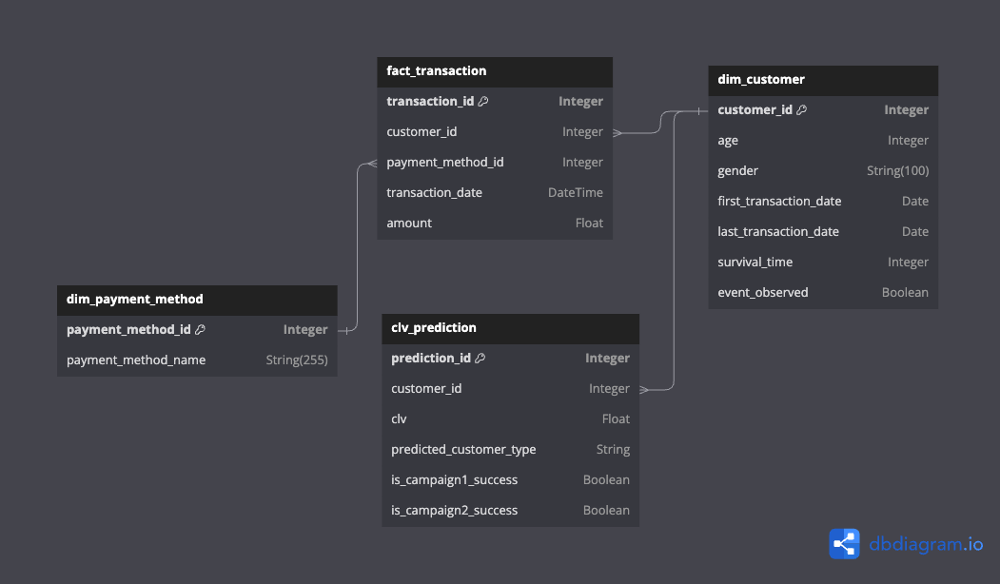

# Internet Service Provider Database Documentation

## Overview

This module is designed for managing and interacting with a database for an internet service provider. It includes a logging setup for tracking operations and a series of SQLAlchemy ORM classes for database interactions.


## Database Models

### Dim_Payment_Method

A dimension table for storing different payment methods.

- `payment_method_id` (Integer, Primary Key): Unique identifier for the payment method.
- `payment_method_name` (String): Descriptive name of the payment method.

### Dim_Customer

A dimension table for storing customer details.

- `customer_id` (Integer, Primary Key): Unique identifier for the customer.
- `age` (Integer): Age of the customer.
- `gender` (String): Gender of the customer.
- `first_transaction_date` (DateTime): Date of the first transaction.
- `last_transaction_date` (DateTime): Date of the last transaction.
- `survival_time` (Integer): Duration between the first and last transaction.
- `event_observed` (Boolean): Indicates if an event (e.g., churn) is observed.

### Fact_Transacation

A fact table for storing transactions.

- `transaction_id` (Integer, Primary Key): Unique identifier for the transaction.
- `customer_id` (Integer, ForeignKey): Links to the customer in `Dim_Customer`.
- `payment_method_id` (Integer, ForeignKey): Links to the payment method in `Dim_Payment_Method`.
- `transaction_date` (DateTime): Date and time of the transaction.
- `amount` (Float): Monetary value of the transaction.
- Relationships with `Dim_Customer` and `Dim_Payment_Method`.

### CLV_Prediction

A table for storing customer lifetime value predictions.

- `prediction_id` (Integer, Primary Key, Auto-increment): Unique identifier for each prediction.
- `customer_id` (Integer, ForeignKey): Links to the customer in `Dim_Customer`.
- `clv` (Float): Predicted Customer Lifetime Value.
- `predicted_customer_type` (String): Type of customer.
- `is_campaign1_success` (Boolean): Success of the first campaign.
- `is_campaign2_success` (Boolean): Success of the second campaign.

### Here is database schema


## Database Initialization

To create all tables in the database, run:

```python
import runpy
runpy.run_module("clv.db.schema")
```

This will use the engine configuration to create tables as per the defined models.

